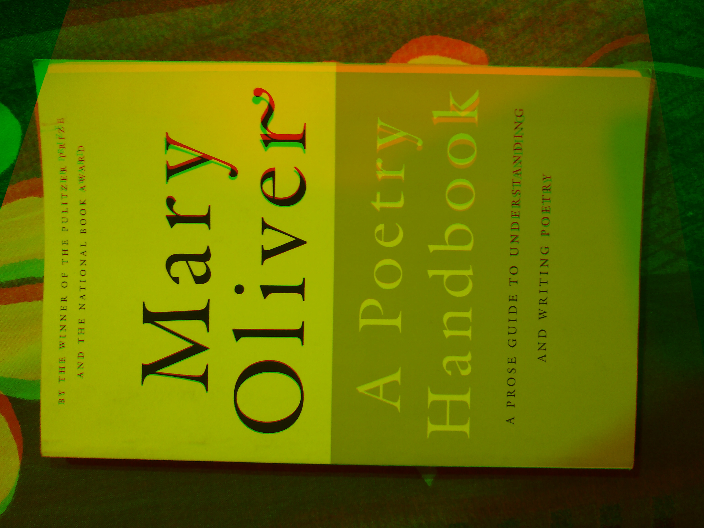

# Registeration Methods

## ECC based registration notebook

```Ecc_demo.ipynb```

## KeyPoint based stitching notebook

```KeypointStitch_demo.ipynb```

## Keypoint: flann and orb demo
```python3 flann_orb.py```

## Sample output




