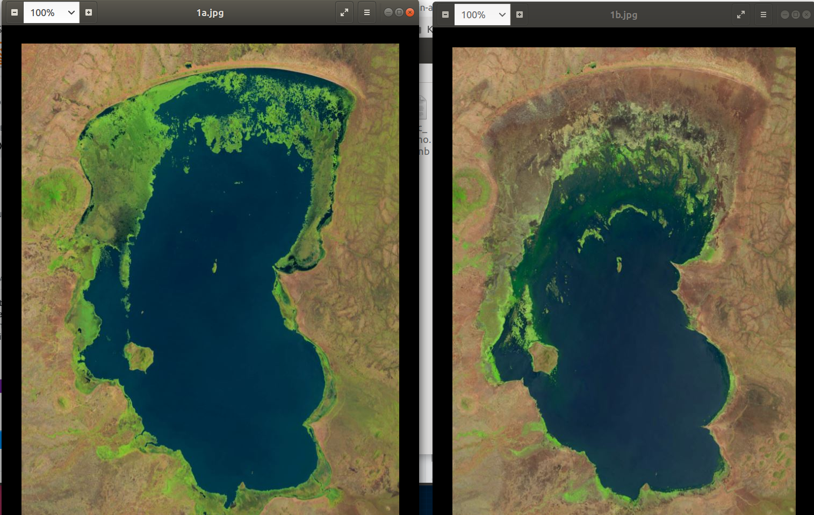
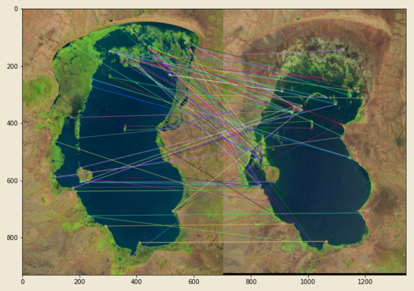

# registeration methods

## ECC based registration demo

```Ecc_demo.ipynb```

## KeyPoint based stitching demo

```KeypointStitch_demo.ipynb```

## Input example



## Keypoint based register



## ECC based


